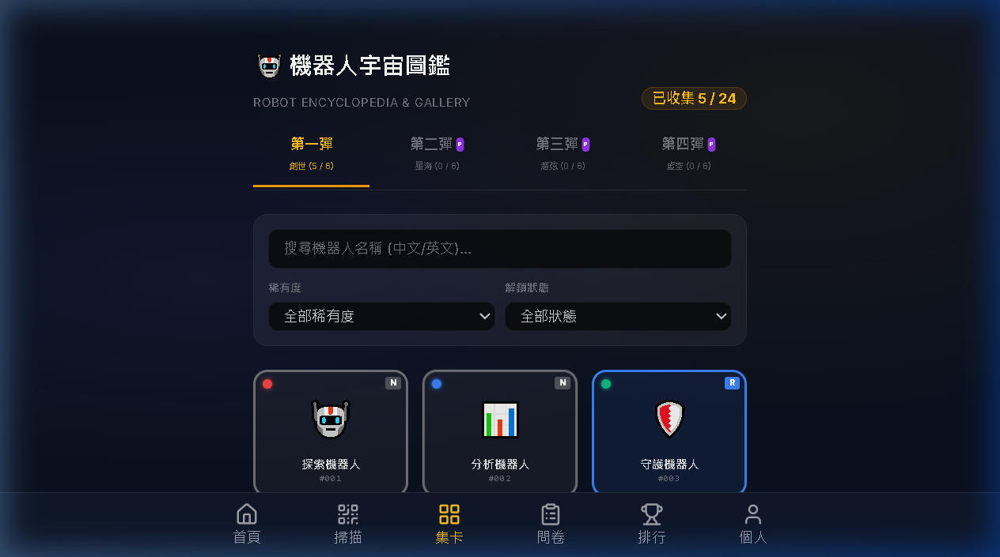
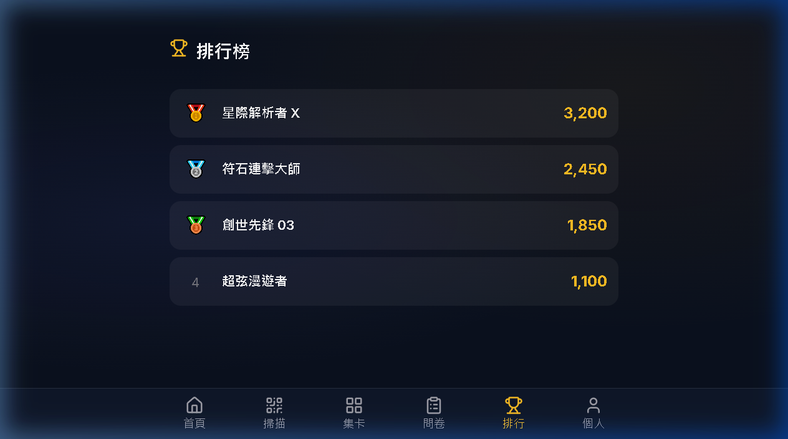
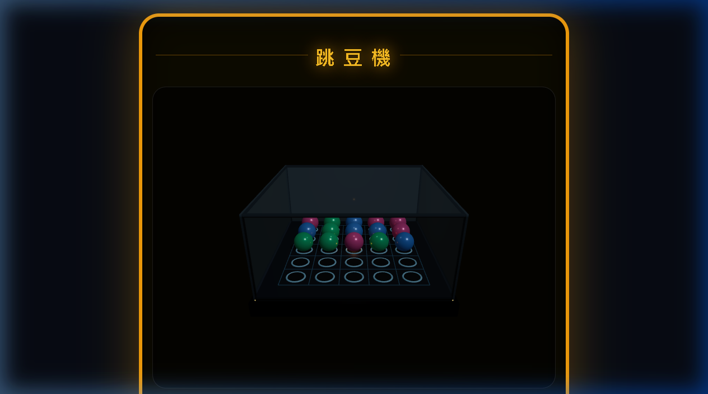
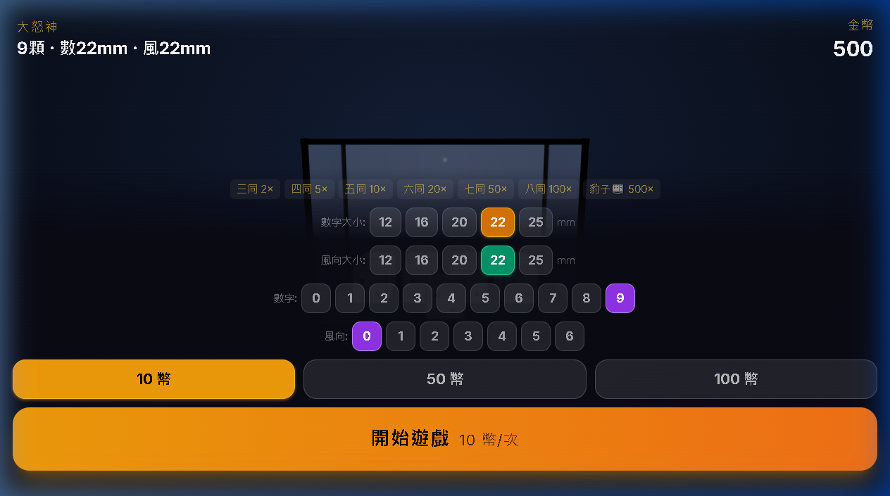
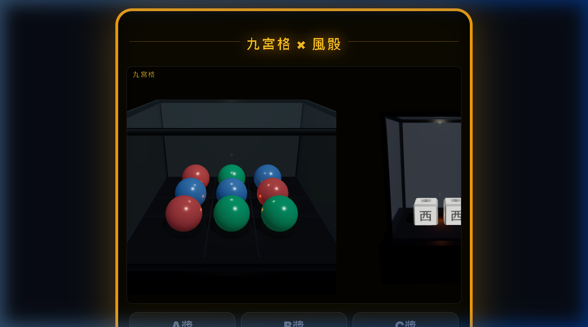
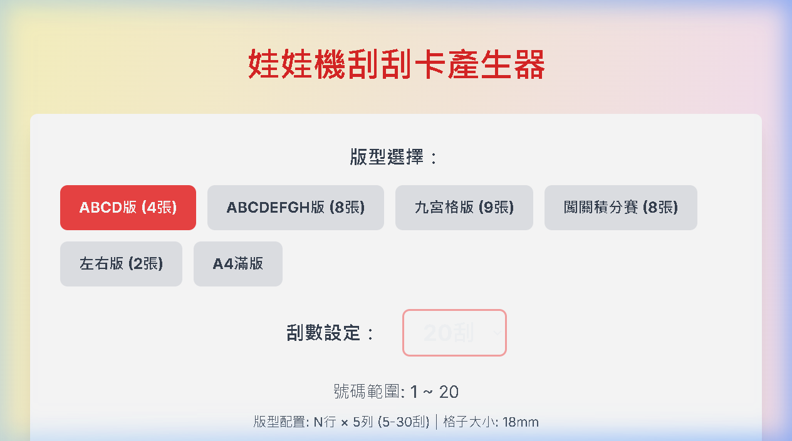

# 🤖 Akade Point - Robot Universe

**星際機器人宇宙 ․ 點數集卡系統**

Akade Point 是一個集**實體卡牌數位化、3D互動遊戲、社群排行榜**於一身的全棧 Web 應用。玩家透過掃描實體卡牌、完成遊戲挑戰賺取點數，系統自動管理卡牌圖鑑、獎勵兌換和玩家排名。

- 🎯 **掃卡集點**：QR-Code 一掃即登錄，實體卡牌永久綁定至數位圖鑑
- 🎮 **6款3D遊戲**：從物理跳豆到城市駕駛，娛樂與競技並行
- 📊 **即時排行榜**：社群積分實時排名，激勵玩家持續互動
- 🎁 **自動獎勵**：達成圖鑑進度自動解鎖 SSR 傳說卡等獎勵
- 👤 **LINE 快速登入**：一鍵登入，無需繁瑣註冊

---

## ✨ 核心功能

### 1. 玩家系統
- **LINE OAuth 驗證**：透過 LINE 帳號快速登入與綁定
- **個人儀表板**：查看積分、抽獎券、卡牌進度、背包戰利品
- **卡牌圖鑑**：追蹤已收集與未收集卡牌（五大屬性 × 稀有度）

### 2. 卡牌掃描與登錄
- 支援**實時 QR-Code 掃描**（ZXing.js）
- 自動更新玩家圖鑑與積分
- 重複掃描防護與交易記錄

### 3. 獎勵兌換系統
根據圖鑑收集進度自動解鎖：
- 🎁 **探索小禮** (30%)
- 💎 **科學中禮** (60%)  
- 🏆 **領航大禮** (90%)
- 👑 **SSR 傳說卡大獎** (100%)

### 4. 後台管理系統
- **卡牌列印引擎** (`/print-cards`)：生成含 QR-Code 的卡牌排版
- **管理控制台** (`/admin`)：使用者、卡牌、登入設定、問卷維護

---

## 🎮 6大互動遊戲

| 遊戲 | 描述 | 特性 |
| :--- | :--- | :--- |
| **跳豆機** 🎯 `/tiao-dou-ji` | 3D物理跳豆發射遊戲 | Rapier 3D物理引擎、重力碰撞、力道控制 |
| **大女神** 🎲 `/da-nu-shen` | 搖晃骰盅擲骰子 | 3D骰子模型、物理搖晃、隨機點數 |
| **九宮格** 🎯 `/jiu-gong-ge` | 網格碰撞投擲遊戲 | 3D球體、風向控制、發射力道、多物理場景 |
| **消除對抗賽** ⚔️ `/test-game` | 五屬性符石消除 | COMBO 連擊、戰隊傷害、實時排行榜、致敬龍族拼圖 |
| **3D城市駕駛** 🏙️ `/city-game` | 駕駛漫遊城市 | Procedural地形、交通流量、虛擬手機UI、FPV無人機模式 |
| **刮刮樂** ✨ `/scratch-card` | Canvas擦除塗層 | 逼真刮刮感、隨機獎勵、盲盒券產出 |

---

## 🖼️ 系統頁面與遊戲示意圖 (Previews & Mockups)

以下為本平台之目前頁面與遊戲互動畫面截圖（已存於 `public/` 目錄中）：

### 🖥️ 首頁與圖鑑系統

| 頁面 | 畫面預覽 |
| :--- | :--- |
| **首頁儀表板 & 動態輪播圖** <br> 包含最新消息、首頁大圖、COMBO 模擬器 |  |
| **宇宙圖鑑 (Card Collection)** <br> 展示已收集與未收集的星際卡牌及屬性 |  |
| **積分排行榜 (Leaderboard)** <br> 實時拉取玩家積分排名 |  |

### 🕹️ 遊戲畫面預覽

| 遊戲 | 畫面預覽 |
| :--- | :--- |
| **跳豆機 (3D Bounce Bean)** <br> 3D 物理反彈發射與碰撞模擬 |  |
| **大女神 (3D Dice Shaker)** <br> 3D 骰盅搖骰體驗 |  |
| **九宮格 (Jiu Gong Ge)** <br> 網格球體投擲與風力控制 |  |
| **消除符石對抗賽 (Battle Arena)** <br> 消除符石引爆連擊，傷害排行榜挑戰 |  |
| **3D 模擬城市 (3D City Simulator)** <br> 3D 載具駕駛與城市漫遊 |  |
| **刮刮樂 (Scratch Card)** <br> 刮除塗層取得盲盒戰利品 |  |

---

---

## 🛠️ 技術棧

| 層級 | 技術 |
| :--- | :--- |
| **前端框架** | Next.js 14 (App Router), React 18, TypeScript |
| **樣式引擎** | Tailwind CSS, Framer Motion |
| **3D/物理** | Three.js, React Three Fiber, Rapier 3D, Drei |
| **掃碼** | ZXing.js (QR-Code) |
| **後端** | Next.js API Routes, NextAuth (LINE Provider) |
| **資料庫** | AWS DynamoDB |
| **部署** | AWS Amplify |
| **測試** | Playwright E2E |

---

## 🚀 快速啟動

### 前置要求
- Node.js 18+
- npm 或 yarn
- AWS 帳號（DynamoDB）
- LINE Developers 帳號（登入整合）

### 安裝與設定

```bash
# 1. 複製倉庫
git clone https://github.com/your-org/akade-point.git
cd akade-point

# 2. 安裝依賴
npm install

# 3. 設定環境變數
cp .env.local.example .env.local
# 編輯 .env.local 填入：
# - LINE Channel ID/Secret
# - NextAuth Secret
# - AWS credentials & DynamoDB table names
```

### 本地開發

```bash
# 4. 初始化資料庫（首次執行）
node scripts/create-tables.mjs

# 5. 啟動開發伺服器
npm run dev
```

開啟 [http://localhost:3000](http://localhost:3000) 即可體驗！

### 可用指令

```bash
npm run dev        # 開發伺服器
npm run build      # 生產構建
npm run start      # 啟動生產伺服器
npm run lint       # 代碼檢查
npm run test:e2e   # Playwright E2E 測試
```

---

## 📁 專案結構

```
akade-point/
├── app/                      # Next.js App Router
│   ├── (auth)/              # 登入相關頁面
│   ├── admin/               # 後台管理系統
│   ├── collection/          # 卡牌圖鑑頁面
│   ├── games/               # 6大互動遊戲
│   │   ├── tiao-dou-ji/     # 跳豆機
│   │   ├── da-nu-shen/      # 大女神
│   │   ├── jiu-gong-ge/     # 九宮格
│   │   ├── test-game/       # 消除對抗賽
│   │   ├── city-game/       # 3D城市駕駛
│   │   └── scratch-card/    # 刮刮樂
│   ├── api/                 # API Routes
│   └── layout.tsx           # 根佈局
├── components/              # React 元件庫
│   ├── GameScene.tsx        # 3D場景基礎元件
│   ├── QRScanner.tsx        # QR-Code 掃描器
│   └── ...
├── lib/                      # 工具函數
│   ├── auth.ts              # NextAuth 設定
│   ├── dynamodb.ts          # DynamoDB 操作
│   └── ...
├── public/                   # 靜態資源 & 預覽圖
└── scripts/                 # 輔助指令
    └── create-tables.mjs    # 初始化資料表
```

---

## 🔐 環境變數參考

```env
# LINE OAuth
NEXT_PUBLIC_LINE_CHANNEL_ID=your_line_channel_id
LINE_CHANNEL_SECRET=your_line_channel_secret

# NextAuth
NEXTAUTH_URL=http://localhost:3000
NEXTAUTH_SECRET=your_secret_key

# AWS DynamoDB
AWS_REGION=ap-southeast-1
AWS_ACCESS_KEY_ID=your_access_key
AWS_SECRET_ACCESS_KEY=your_secret_key
DYNAMODB_USERS_TABLE=users
DYNAMODB_CARDS_TABLE=cards
DYNAMODB_INVENTORY_TABLE=inventory
```

---

## 🤝 貢獻指南

1. Fork 本倉庫
2. 建立功能分支 (`git checkout -b feature/amazing-feature`)
3. 提交變更 (`git commit -m 'feat: add amazing feature'`)
4. 推送到遠端 (`git push origin feature/amazing-feature`)
5. 開啟 Pull Request

### 提交規範
遵循 [Conventional Commits](https://www.conventionalcommits.org/) 格式：
- `feat: ` 新功能
- `fix: ` 錯誤修復
- `refactor: ` 程式碼重構
- `docs: ` 文件更新
- `test: ` 測試新增
- `perf: ` 性能優化

---

## 📝 授權

MIT License - 詳見 [LICENSE](./LICENSE)

---

## 💬 聯絡與支持

- 📧 Email: support@akade.point
- 🐛 Issues: [GitHub Issues](https://github.com/your-org/akade-point/issues)
- 💡 Discussions: [GitHub Discussions](https://github.com/your-org/akade-point/discussions)

**Made with ❤️ by Akade Team**
