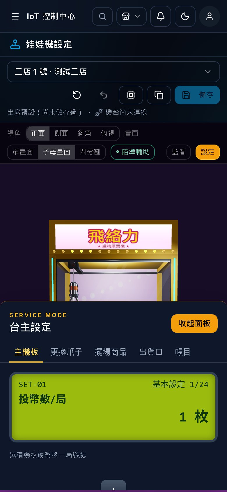
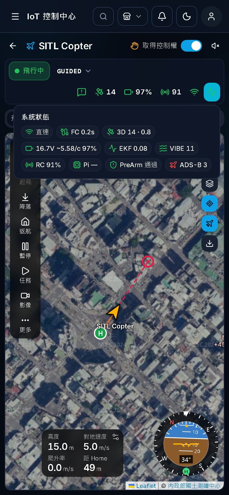
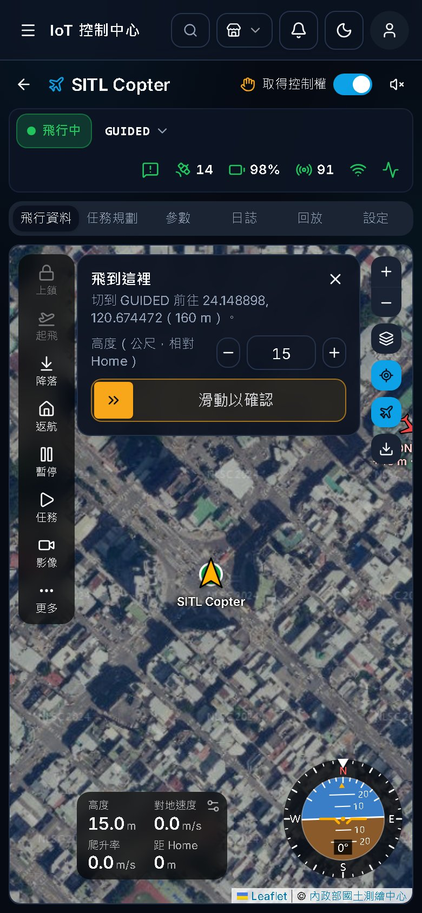

# IoT 控制中心使用者手冊

IoT 控制中心是在瀏覽器裡使用的後台：
- **門市人員**：監控娃娃機、處理警報、調整機台設定。
- **飛手**：操作無人機與無人車。

本手冊依角色與工作流程說明每個畫面。截圖是在手機（iPhone 13 寬度）上拍的；會捲動的頁面是整頁長截圖，所以一張圖就是整頁內容。電腦上版面較寬，左側選單固定展開，其餘操作相同。截圖取自本機測試環境：照片是測試相機畫面，機台是示範資料。細節與設定方式見文末的[延伸閱讀](#延伸閱讀)。

## 系統全貌

所有操作都在瀏覽器裡完成。網頁經雲端的控制中心指揮載具；近距離或經 VPN 時，也能直接連到載具上的樹莓派。

- **雲端連線**：每秒更新一次，在哪裡都能用（包括 4G）。
- **直連**：每秒更新 10 次，搖桿與雲台的連續控制只走這條。
- **自動切換**：兩條都有時，頁面優先用直連；直連中斷就退回雲端。
- **娃娃機**：主機板定時向雲端拉取已儲存的設定。

## 開始使用

用瀏覽器開啟控制中心，以 LINE 登入，進站後是儀表板。沒有任何角色的帳號進不了控制中心，第一次使用請先找系統管理員，或你門市的門市管理員，替你加上角色。

1. 開啟控制中心網址，按「LINE 登入」。
2. 右上角選擇門市。多數頁面以目前門市為準，清單裡只會出現你有權限的門市。
3. 從選單進入各頁面：手機按左上角 ☰ 打開；電腦的選單在左側，按底部的「收合」可以縮小。
4. 換語言：「設定」→「外觀」→「語言」，可選繁體中文、English、日本語，選了立即生效。

*儀表板（手機）：上方為機台數與警報統計，往下是最近事件與進行中的警報。手機上最近事件列出最新 10 筆。*

| 畫面位置 | 用途 |
| --- | --- |
| 頂端搜尋（Ctrl／⌘ + K） | 跳到任何頁面，或用名稱、設備 ID 找機台 |
| 門市選單 | 切換目前門市 |
| 鈴鐺 | 進行中的警報；點一則會標為已確認，並打開該機台 |
| 月亮圖示 | 切換深色／淺色主題 |
| 人像圖示 | 你的名字與角色，以及你在各門市的角色 |
| 選單（手機按 ☰） | 儀表板、控制中心、機台、娃娃機設定、載具、警報、歷史紀錄、數據分析、門市管理、使用者、設定 |

你的角色只能查看某頁時，頁面上方會出現「只能查看」提示，並說明修改需要哪個角色；對應的按鈕會變灰。

### 在手機上使用

控制中心在手機瀏覽器也能用，版面會自動調整，畫面內容不會被切掉：

- **選單**：按左上角 ☰ 打開。
- **清單**：機台、載具、歷史紀錄、門市、品牌、使用者在手機上都是一張張卡片，整頁上下捲動，不必左右滑。
- **長的清單**：回放的航班、樹莓派上的日誌先列最新幾筆，按「顯示全部」看其餘；雲端照片一次載入 8 張，按「載入較舊的」看更早的。
- **文字**：名稱、訊息、下拉選單的選項太長時會換行，不會被截掉。
- **地面站**：飛行資料是一整個畫面的地圖，按鈕與儀表都浮在地圖上（見[飛行資料](#飛行資料)）；其他頁籤整頁捲動，任務規劃的地圖固定在畫面上方。
- **平面圖**：打開時自動縮放到看得見整個平面圖；手機上只能檢視與切換即時模式，新增元件與編輯屬性請用平板或電腦。
- **娃娃機設定**：模擬器佔一整個畫面，設定面板從下方升起；按「收起面板」可看完整機台。

## 角色與權限

每個人有一個全域角色（套用到所有門市），還可以在個別門市另有門市角色；在某間門市，以兩者中較高的為準。只有門市角色的人，只看得到自己那幾間門市與它們的載具。

| 要做的事 | 最低角色 | 可用門市角色取得 |
| --- | --- | --- |
| 查看儀表板、機台、載具、歷史與分析 | 檢視者 | 是 |
| 確認、解決警報；登記維修 | 操作員 | 是 |
| 取得載具控制權、下指令、編輯與上傳任務 | 操作員 | 是 |
| 新增與編輯機台、群組、平面圖、門市設定 | 門市管理員 | 是 |
| 儲存與套用娃娃機設定 | 門市管理員 | 是 |
| 管理門市成員、刪除雲端照片與日誌 | 門市管理員 | 是 |
| 新增或刪除門市、編輯品牌 | 門市管理員 | 否，需全域 |
| 管理使用者與全域角色 | 系統管理員 | 否 |
| 新增與編輯載具、產生 Token、MAVLink 簽章 | 系統管理員 | 否 |

不屬於任何門市的載具，只有全域角色看得到。完整規則見 [`permissions.md`](./permissions.md)。

## 機台與門市

每台娃娃機的即時狀態在「機台」頁，店內擺設在「控制中心」平面圖，異常在「警報」頁處理。所有角色都能查看；新增、編輯、刪除機台需要該門市的門市管理員。

### 機台清單

*機台目錄（手機）：依狀態分頁，可用門市、群組、名稱篩選；每台一張卡片，右下是檢視、編輯、刪除。*

- **狀態分頁**：上方的「全部／在線／警告／警報／離線」顯示各狀態的數量，點一下就篩選。
- **每台的按鈕**：
  - 眼睛圖示：打開機台抽屜。
  - 鉛筆：編輯。
  - 紅色垃圾桶：刪除。
  - 你不是該門市的門市管理員時，鉛筆與垃圾桶是灰的。
- **新增機台**：門市選單只列出你能管理的門市。

*機台抽屜（手機）：電流曲線、心跳、門禁、WiFi、韌體；標題下的「娃娃機設定」直接開啟這台的設定。*

抽屜有三頁：
- **即時**：電流與連線狀態。
- **總覽**：基本資料與維修紀錄。
- **歷史**：這台的事件。

### 平面圖（控制中心）

*平面圖（手機）：打開時自動縮放到整個平面圖，可縮放、搜尋機台與切換即時模式；編輯要用平板或電腦。*

在平板或電腦上編輯（畫面左側是元件庫，右側是屬性與圖層）：

1. 按右上「編輯模式」，把左側元件（機台、文字、區域、攝影機…）拖到畫布。
2. 點選元件，在右側「屬性」把它綁定到實際機台。
3. 按「儲存」。「版本」可另存幾個版本，並指定目前使用哪一個。
4. 切到「即時模式」，每台機台會依狀態變色。

- **快捷鍵**：
  - Ctrl+Z／Y：復原與重做。
  - Ctrl+C／V：複製貼上；Ctrl+D：複製一份。
  - Delete：刪除；Esc：取消選取。
- **未儲存提醒**：有未儲存的變更時，切換門市或關閉分頁會先詢問。

### 警報、歷史紀錄與數據分析

| 頁面 | 可以做什麼 | 最低角色 |
| --- | --- | --- |
| 警報 | 依狀態（進行中／已確認／已解決／已忽略）與門市篩選；確認、解決或忽略一則警報 | 操作員 |
| 歷史紀錄 | 依日期、機台、事件類型查詢；匯出 CSV／Excel | 檢視者 |
| 數據分析 | 正常運行率、警報數、解決率與各門市圖表 | 檢視者 |

「設定」頁多數項目以門市為單位（版面、通知、店鋪資訊等），切換門市會套用那間門市的設定；修改需要門市管理員。

## 娃娃機設定

每台娃娃機各自保存主機板參數、爪子、擺場商品與出貨口。在 3D 模擬器試夾滿意後按「儲存」，機台上的 ESP32 就會拉取並套用。變更設定需要該門市的門市管理員。

 

*娃娃機設定（手機）：左圖是模擬器，上方選機台，工具列依序是載入出廠值、放棄變更、機台連線、套用到其他機台、儲存；右圖是從下方升起的「台主設定」面板。電腦上機台清單在左側，面板在右側。*

1. 選一台機台（手機是上方的下拉選單，電腦是左側清單）。清單顯示它的版本、儲存日期、強／中／弱電壓與爪子；「出廠預設」表示從未儲存過。
2. 在「台主設定」調整：主機板、更換爪子、擺場商品、出貨口、帳目。變更會立即反映在模擬器，但還沒寫進機台。
3. 在模擬器試夾：按「收起面板」，按「投幣」，用搖桿或方向鍵移動，按「下爪」或空白鍵下爪。
4. 按「儲存」或 Ctrl／⌘ + S，寫入這台機台。

| 按鈕 | 作用 |
| --- | --- |
| 載入出廠值 | 把草稿改回出廠設定（按儲存才生效） |
| 放棄變更 | 回到上次儲存的版本 |
| 套用到其他機台 | 把已儲存的設定複製到多台：可只複製主機板，或只複製爪子／商品／出貨口；只列出你能管理的門市 |
| 機台連線 | 產生 ESP32 Token（只顯示一次）、看最後連線與機台目前版本、中斷連線（系統管理員） |

- **套用狀態**：工具列下方顯示已套用、等待拉取、套用失敗、離線或尚未連線。
- **多久生效**：機台每 30 秒拉一次；伺服器與機台都設定了即時通知時，儲存後約 1 秒就會套用。
- **別人先存了**：會詢問要「載入最新版本」還是「用我的設定覆蓋」。
- **紀錄**：每次儲存與複製都會記在該機台的事件紀錄。

## 門市成員

門市管理員可以自己管理門市的團隊：加入新人、調整角色、移除離職的人，不必找系統管理員。入口在「門市管理」→「門市」分頁，每間門市的人像圖示。

*門市分頁（手機）：每間門市一張卡片，下方有「成員」（人像）、編輯、刪除；只有你能管理成員的門市會出現人像圖示。*

加入一位成員：

1. 按該門市的人像圖示，打開「成員」視窗。
2. 在「新增成員」輸入對方完整的 Email（不分大小寫）或使用者 ID，按「查詢」。
3. 確認名字正確後，選角色，按「加入」。

*成員視窗（手機）：列出在這間門市有角色的人，可改角色或移除；下方用 Email 或 ID 加入新成員。*

- **查不到人**：對方要先用 LINE 登入過一次才查得到。為了保護個資，這裡不會列出所有帳號。
- **改角色或移除**：改角色直接在該列的選單選；移除按該列的紅色圖示。只會移除這間門市的角色，對方在其他門市與全域的角色不變。
- **有全域角色的人**：也會列出（標示「全域：…」），但他們的權限來自其他地方，這裡改不到。
- **等級限制**：
  - 你只能指派到自己的等級，也不能改同級或更高的人。
  - 你任命的門市管理員，之後要撤掉得找系統管理員。

系統管理員另有完整的「使用者」頁：列出所有帳號，每人可設全域角色，按「門市權限」逐店設定。

 

*左：使用者頁（系統管理員，手機），每人一張卡片，左邊選單是全域角色，右邊「門市權限」按下可逐店設定。右：門市權限視窗，每間門市選一個角色，或「無（依全域角色）」。*

## 載具地面站

每台無人機或無人車都有自己的網頁地面站。頁籤分工仿 Mission Planner：飛行資料、任務規劃、參數、日誌、回放、設定；飛行資料畫面仿 QGroundControl：地圖佔滿畫面，儀表與按鈕浮在地圖上。任何角色都能觀看；下指令與編任務需要該載具所屬門市的操作員以上。

### 車隊

*載具頁（手機）：上方地圖顯示所有有位置的載具，下方每台一張卡片：連線、名稱、更新時間、模式、解鎖、電量、GPS、門市。*

點載具名稱進入它的地面站。新增載具（系統管理員）要填名稱、類型、Companion ID 與所屬門市；不屬於任何門市的載具，只有全域角色看得到。

### 飛行資料

 

*左：飛行資料（手機，飛行中）。頁首下方是工具列，左側是動作列，下方是數值列與姿態羅盤；地圖上的紅色虛線指向「飛到這裡」的目標，H 是 Home。右：按工具列最右邊的「系統狀態」，列出所有燈號。*

- **工具列**：
  - **主狀態**：可以飛行、未就緒、已解鎖、飛行中、失去連線等；按一下列出未通過的解鎖檢查。
  - **模式**：按下拉選單直接切換，要先取得控制權。
  - **指示器**：從左到右是訊息、GPS 衛星數、電量、遙控訊號、連線、系統狀態。每個都按得開看細節；綠色正常、黃色注意、紅色危險。
- **動作列**（左側）：解鎖／上鎖、起飛、降落、返航、暫停、任務、影像、更多。現在不能用的會變暗，例如還沒解鎖時的降落。
- **數值列**（左下）：無人機是高度、對地速度、爬升率、距 Home；無人車是速度、距 Home、距航點、航向。右上的齒輪可以換欄位。
- **姿態羅盤**（右下）：中間是姿態（藍色天空、棕色地面），外圈是羅盤，機首永遠朝上；綠色 H 指向 Home，下方是航向。
- **地圖**：
  - 右側按鈕：縮放、換底圖（國土測繪中心、OSM、衛星）、跟隨載具、ADS-B、預先下載圖磚。
  - 長按（電腦按右鍵）地圖：「飛到這裡」「設為 Home」「量距離」「雲台看這裡」。
- **語音**：頁首的喇叭圖示。電量低、解鎖檢查失敗、失聯時會唸出來。

| 指示器 | 意思 | 要注意 |
| --- | --- | --- |
| 主狀態 | 可以飛行／未就緒／已解鎖／飛行中／失去連線 | 「未就緒」時按一下看原因；「失去連線」時動作列全部變暗 |
| 訊息 | 重要飛控訊息的數量 | 有數字時按開看內容 |
| GPS | 衛星數；按開看定位類型與 HDOP | 沒有 3D 定位不要解鎖 |
| 電池 | 剩餘電量；按開看總電壓、每芯電壓、電流、已用 | 每芯低於 3.6 V 變黃、3.45 V 變紅 |
| 訊號 | 遙控 RSSI；按開另有數傳 RSSI | 過低時注意失控 |
| 連線 | 雲端、直連與飛控心跳 | 紅色表示斷線 |
| 系統狀態 | EKF、震動、樹莓派、PreArm、ADS-B、地形等全部燈號 | 任一項變紅就不要解鎖 |

### 取得控制權與下指令

打開頁首的「取得控制權」才能下指令。同一時間只有一位操作者，其他人會看到「某某正在控制這台載具」。關掉開關或關閉頁面就會釋放控制權。

 

*左：滑動確認（手機）。按下動作後，地圖上方出現說明；起飛與飛到這裡可以調整高度，滑到底才送出。右：「更多」面板整面展開，手機上從下方升起、可上下捲動。*

1. 按左側動作列的動作，例如「起飛」。
2. 讀地圖上方的說明；起飛與飛到這裡可以用 −／+ 調整高度（每次 5 公尺）。
3. 把滑桿滑到底才會送出；按 ✕ 取消。解鎖檢查未通過時，解鎖與起飛的滑桿不能滑，並顯示原因。
4. 飛行中可以：
   - 長按地圖（電腦右鍵）選「飛到這裡」。
   - 按「返航」回 Home、「降落」原地降落、「暫停」在空中停住。
   - 按「任務」開始已上傳的任務；任務進行中同一個按鈕變成「暫停任務」，暫停後變成「繼續任務」。

「更多」打開面板（手機從下方升起，電腦在地圖右側）：
- **動作**：改模式、改速度、改高度、跳到第 N 個航點、強制上鎖、重開飛控、跟隨我，以及指令紀錄。
- **數值**：大字的高度、速度、電壓、電流、風等欄位，按「自訂」可挑選。
- **HUD**：Mission Planner 風格的姿態儀、速度帶、高度帶。
- **訊息**：飛控訊息與完整的解鎖檢查原因。
- **圖表**：最近 5 分鐘的即時曲線。
- **有對應設備時才出現**：雲台、相機、酬載、駕駛。

操作方式與鏈路細節見 [`vehicles-gcs.md`](./vehicles-gcs.md)。

## 任務、參數、日誌與回放

| 要做的事 | 在哪個頁籤 |
| --- | --- |
| 畫航線 | 任務規劃 |
| 改飛控設定 | 參數 |
| 下載照片與日誌 | 日誌 |
| 重看飛完的軌跡 | 回放 |

上傳任務、寫參數之前，要先取得控制權。

### 任務規劃

*任務規劃（手機）：地圖在上方，往下捲動時固定在畫面頂端；下面是任務／電子圍籬／Rally 點、任務選單、上傳與下載、航程統計（航程、預估時間、最高、最遠）與航點清單。電腦上左邊是清單，右邊是地圖。*

1. 選「任務」「電子圍籬」或「Rally 點」。
2. 按「新增航點」後點地圖加點；航點可拖曳，兩點中間的小圓點可插入新點。
3. 用工具產生航線：
   - 「測繪」：圈出範圍，產生割草機航線與拍照指令。
   - 「環繞」：產生繞圈航線。
   - 「續飛」：從第 N 點接著飛。
4. 按「儲存」存到雲端，按「上傳到載具」寫進飛控。上傳後系統會自動下載比對，確認飛控裡的任務跟畫面一樣。

- **航線警告**：有問題時航點清單上方會出現紅字，例如缺少起飛點、高度超過 120 公尺、航點在圍籬外。
- **匯入／匯出**：支援 Mission Planner 的 `.waypoints` 檔。

### 參數

*參數（手機，搜尋「BATT_」）：從載具讀取全部，可搜尋、只看修改中，或切到「安全設定」「比對」。*

- **讀取**：「從載具讀取全部」會把整份參數存成快照；展開一列可以看 ArduPilot 的說明。
- **寫入**：改完後按「寫入 N 項」，系統會先列出差異讓你確認。
- **安全設定**：整理了電池、失效保護、圍籬、返航高度等常用項目，並檢查常見設錯。
- **比對**：可與 `.param` 檔或較早的快照比較，勾選要套用的項目。

### 日誌與雲端檔案

*日誌（手機）：最上方「雲端檔案」有照片、DataFlash、遙測日誌三個分頁，照片附拍攝時間與座標；往下是樹莓派上的遙測日誌（先列最新 8 個）、飛控的 DataFlash 與分析工具連結。圖中照片是測試相機畫面。*

- **自動上傳**：樹莓派會把照片、DataFlash 日誌與每趟飛行的遙測日誌上傳到雲端，載具關機或離線時也看得到。
- **上傳時機**：照片拍完就傳；日誌等上鎖後才傳，避免飛行中佔用頻寬。
- **下載與刪除**：
  - 下載：按每張卡片上的箭頭。
  - 刪除：紅色垃圾桶，需要該門市的門市管理員。樹莓派上的原檔不受影響。
- **分析日誌**：用頁面最下方連結的 UAV Log Viewer 或 ArduPilot WebTools，把下載的檔案拖進去即可。

上傳機制與伺服器設定見 [`vehicles-files.md`](./vehicles-files.md)。

### 回放

*回放（手機）：上方是 7 天內的每趟飛行（時間、距離、最高高度、耗電、照片數），手機先列最新 4 趟；地圖上的紫點是拍照位置，下方可播放與拖曳時間。*

- 選一趟飛行，地圖會畫出軌跡與拍照點。
- 按播放或拖曳時間軸，可以看當時的高度、速度與電量；右邊可選 1×／4×／16× 速度。
- 點紫點會跳出那張照片。

### 設定

*載具設定（手機）：直連網址、影像網址、設定步驟，往下是 Companion Token 與 MAVLink2 簽章。*

「設定」分頁多半由系統管理員設定一次：
- **直連網址**：讓頁面直接連到樹莓派，每秒 10 次更新。
- **影像網址**：MediaMTX 的即時影像。
- **Companion Token**：只顯示一次；重新產生會讓舊的失效。
- **MAVLink2 簽章**：在飛控上啟用或關閉。

## 安全須知與常見問題

操作載具前，先確認這五件事：

1. **先取得控制權**：同一台載具同時只有一位操作者，其他人只能觀看。接管別人時會通知對方，並寫進訊息紀錄。
2. **看清楚工具列**：主狀態不是「可以飛行」，或 GPS、電池、系統狀態任一項變紅，就不要解鎖。
3. **滑到底之前先讀說明**：
   - 解鎖、起飛、降落、返航、暫停、飛到這裡、任務，都要把滑桿滑到底才會送出。
   - 寫參數、重開機會再問一次。
   - 強制上鎖藏在「更多」→「動作」裡，要輸入確認字才會送出。
4. **失去連線時不要慌**：資料過期時主狀態變成「失去連線」、動作列全部變暗，載具會依飛控的失效保護動作（通常是返航）。
5. **啟用 MAVLink 簽章前先通知所有人**：
   - Mission Planner 要輸入同一組密語才連得上。
   - 接在飛控埠上的 STorM32 或 ESP32，需要把該埠 `MAVn_OPTIONS` 第 0 位設為 1 並重開機。
   - USB 一律可連，萬一出問題可用來救回。

| 狀況 | 原因與處理 |
| --- | --- |
| 看不到某間門市或某台載具 | 你在那間門市沒有角色。請該門市的門市管理員或系統管理員把你加入。 |
| 按鈕是灰的 | 角色不足（頁面上方會出現「只能查看」提示），或還沒取得控制權。 |
| 動作列的按鈕變暗 | 現在的狀態用不到（例如還沒解鎖時的降落），或資料已過期。按下去會說明原因。 |
| 解鎖被拒：Need Position Estimate | 飛控剛開機約 20 秒內定位尚未收斂，稍等再試。 |
| 直連一直失敗 | HTTPS 網頁只能連 `wss://`；Chrome 跳出「存取區域網路裝置」時要按允許。原因會顯示在載具的「設定」頁。 |
| 雲端檔案顯示「伺服器沒有設定檔案儲存」 | 系統管理員尚未設定檔案儲存（S3 bucket），照片與日誌暫時不會上傳。 |
| 雲端照片沒有位置 | 拍攝當下沒有 GPS 定位。 |
| 娃娃機顯示「等待拉取」 | 機台每 30 秒拉一次設定；有即時通知（MQTT）時約 1 秒內套用。 |
| 找不到要加入的成員 | 對方要先用 LINE 登入過一次；請用完整的 Email 或使用者 ID 查詢。 |

## 延伸閱讀

| 文件 | 內容 |
| --- | --- |
| [`permissions.md`](./permissions.md) | 角色、門市角色與各 API 的權限規則 |
| [`claw-machine-configs.md`](./claw-machine-configs.md) | 娃娃機設定的欄位與儲存方式 |
| [`claw-machine-esp32.md`](./claw-machine-esp32.md) | ESP32 拉取設定、Token 與即時通知 |
| [`vehicles-gcs.md`](./vehicles-gcs.md) | 地面站各頁籤、鏈路、控制權的細節 |
| [`vehicles-camera.md`](./vehicles-camera.md) | 樹莓派相機與測繪拍照 |
| [`vehicles-files.md`](./vehicles-files.md) | 照片與日誌上雲、S3 設定 |
| [`vehicles-security.md`](./vehicles-security.md) | Token、直連與 MAVLink2 簽章 |
| [`api-reference.md`](./api-reference.md) | 程式化存取的 API |
